<!-- Static header: normal HTML text, always visible -->
<h1>Hi, I'm Lionel Li</h1>

<!--
Typing SVG component
Edit guide:
- lines: each sentence is separated by ";"
- use "+" for spaces
- encode comma as "%2C" and apostrophe as "%27"
- color/background: hex values without "#"
- docs: https://github.com/DenverCoder1/readme-typing-svg
-->

<!--
Social icons section
Edit guide:
- href: replace with your real profile URL
- src: replace with the Imgur PNG icon URL if you want a different icon
- &#8287; adds visual spacing between icons
-->

&#8287;&#8287;&#8287;&#8287;&#8287;&#8287;&#8287;&#8287;&#8287;&#8287;

---

<!--
Technologies & Tools section
Hardcoded from resume:
- add/remove one  line to edit the stack
- shields.io badges use: label-color?style=for-the-badge&logo=...
-->
<h2 align="center">🛠️ Technologies & Tools</h2>

<h4 align="center">Languages</h4>

  
  
  
  
  
  
  

<h4 align="center">Frameworks & Frontend</h4>

  
  
  
  
  
  

<h4 align="center">Data, DevOps & Testing</h4>

  
  
  
  
  
  
  
  
  
  

---

<!--
GitHub Status section
Generated by .github/workflows/metrics.yml.
The SVG appears after the workflow runs successfully.
-->
<h2 align="center">📊 GitHub Status</h2>

  

